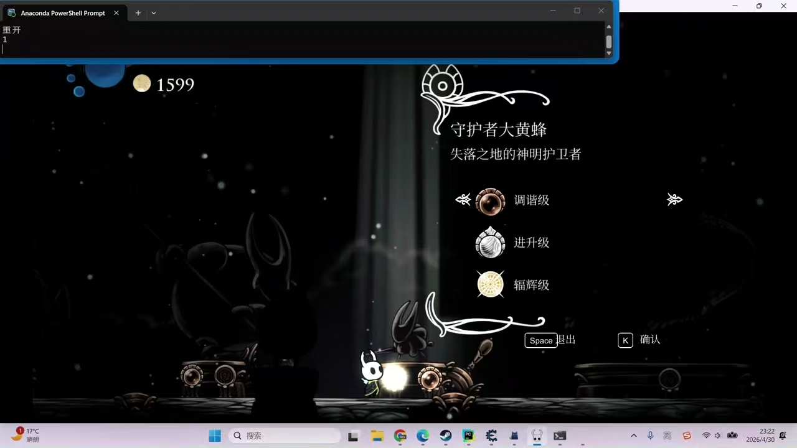

基于空洞骑士的大黄蜂boss战开发出来的强化学习模型，分别训练了DQN和PPO模型，模型采用攻击头与移动头的双头形式，采用了较为复杂的奖励函数，力求小骑士能够主动追击boss。经过3w步左右最终实现10局5胜

## 🎬 Demo

## Environment

- windows 11 (We use win32 API to operate the little knight and get screenshots)
- python 3.9
- python liberary: find in `requirments.txt`
- Hollow Knight
- HP Bar mod for Hollow Knight (In order to get the boss hp to calculate the reward, please find the mod in `./hollow_knight_Data/`, and then copy the mod file to the game folder)

## Code structure
- Most training configuration is in `train.py`
- `Agent.py` gets output actions from our model
- `DQN.py` "PPO.py" is the learning algorithm
- `Model.py` defines the model we use
- `ReplayMemory.py` defines the experience pool for learning
- `test.py` is useless, I use it to test basic functions and fix bugs

- Files in `./Tool` are for other functions we may use
- `Actions` defines actions for little knight and restart game script
- `GetHp` help us get our hp, boss hp, soul and location(it may have some bugs, you can fix it by yourself)
- `SendKey` is the API we use to send keyboard event to windows system.
- `UserInput` is an useless file, which I used it to train my model manually.
- `WindowsAPI` is used to get screenshot of the game, and `key_check()` is used to check which key is pressed.
- `Helper` defines [Reward Jugment] fucntion, and other functions we may use
